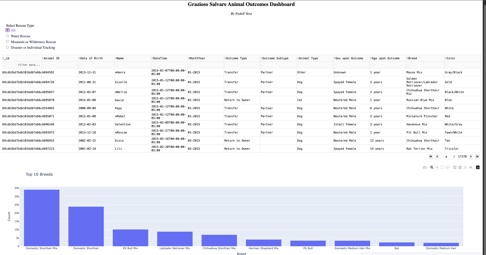
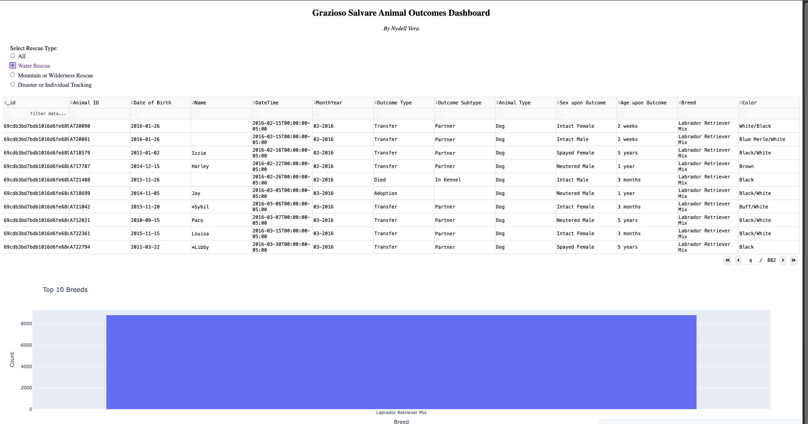
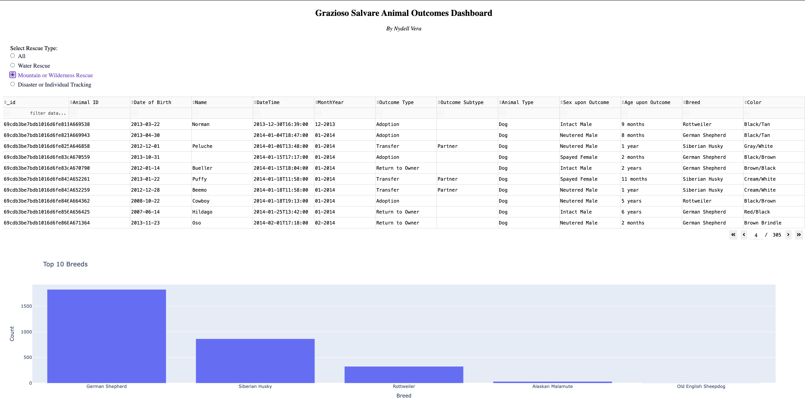
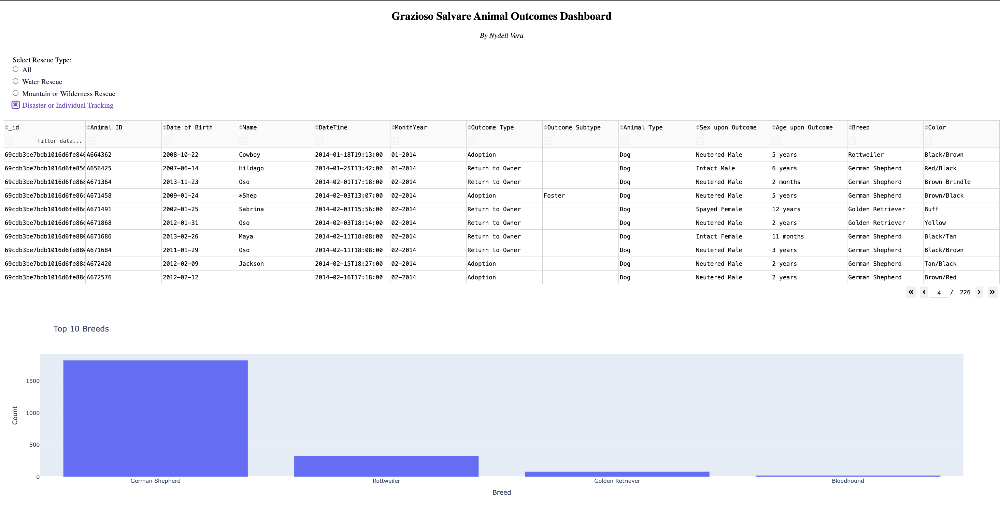

# Animal Shelter Analytics Dashboard

## Overview

This project is an interactive analytics dashboard built using Python, Dash, Plotly, and MongoDB. 
The goal of the dashboard is to help users explore and analyze animal shelter data through interactive visualizations, filters, and maps.

I developed this project to gain hands on experience working with databases, data visualization, and dashboard development while applying data analytics concepts to a real-world dataset.

---

  
  

  
  

## Features

- Interactive dashboard built with Dash and Plotly
- MongoDB integration for storing and retrieving shelter records
- Dynamic filtering of animal records
- Interactive charts and visualizations
- Geospatial mapping of animal locations
- CRUD functionality for managing shelter data
- Responsive dashboard layout

---

## Technologies Used

- Python
- Dash
- Plotly
- MongoDB
- Pandas
- Jupyter Notebook

---

## Skills Demonstrated

This project helped me strengthen my skills in:

- Data visualization
- Dashboard development
- Database querying
- MongoDB
- Python programming
- Data analysis
- Building interactive web applications
- Working with real-world datasets

---

## What I Learned

Working on this project gave me practical experience connecting Python applications to a MongoDB database and building interactive dashboards with Dash and Plotly. 
It also helped me better understand how data can be transformed into visual insights that make information easier to explore and analyze.

This project strengthened my understanding of backend database operations, frontend dashboard design, and how different technologies work together in a complete analytics application.

---
## Author

**Nydell Vera**

Bachelor of Science in Computer Science

Interested in Data Analytics, Business Intelligence, and Data Engineering.
